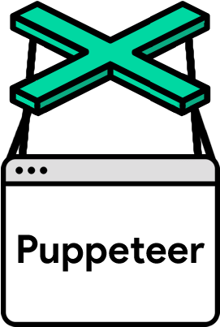

# </img> Puppeteer Crawler
<a href="./README.md"></img> 한국어 보전 보기</a>
## Neccessary Libraries
For run the project you will need to install the express, puppeteer and mysql libraries. You can install them using the following commands.
```
npm install express
npm install puppeteer
npm install mysql
```
## Database
The scrapped data will be saved in database. You can import the database by using crawled_info.sql file.
## How to run
```
cd Nodejs_Crawling
node crawler.js
```
## 스크린샷
### 실행콘솔

### DB 슥크린샷

## 기타
<ul>
  <li>앱은 지금 쿠팡 쿠롤링 하고 있습니다.</li>
  <li>원래, 쇼피와 네이버쇼핑을 지원할 계획이 있었는데 시간이 부족해서 쿠팡까지만 했고 네이버쇼핑과 쇼피를 disable오로 버꿨습니다.</li>
</ul>
